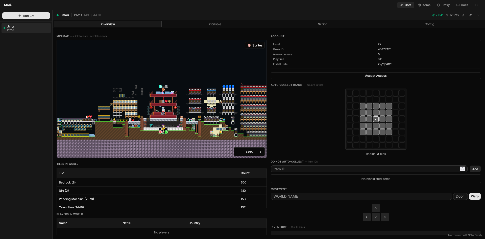

<br />
<div align="center">
  <a href="https://github.com/JansFrans/Jato">
    
  </a>

  <h1 align="center">Jato</h1>

  <p align="center">
    <strong>A Modern, Cross-Platform Growtopia Automation Framework</strong>
    <br />
    <br />
    <a href="https://discord.gg/a6FqT4G3dR">Discord</a>
    ·
    <a href="https://github.com/JansFrans/Jato/issues">Report Bug</a>
    ·
    <a href="https://github.com/JansFrans/Jato/issues">Request Feature</a>
  </p>
</div>

<div align="center">
  <a href="https://github.com/JansFrans/Jato/stargazers"></a>
  <a href="https://www.rust-lang.org/"></a>
  <a href="https://react.dev/"></a>
  <a href="https://github.com/JansFrans/Jato"></a>
  <a href="https://discord.gg/a6FqT4G3dR"></a>
</div>

---

## 📖 About The Project

**Jato** is an open-source Growtopia automation framework entirely written in **Rust**. 

Unlike traditional companion bots that depend on native Windows desktop interfaces, Jato operates purely via a lightweight local web dashboard. This allows you to monitor, control, and script multiple bots directly from any modern browser on any operating system, eliminating platform lock-in.

> Star this project if you're following along — any contribution helps a lot!

---

## ✨ Features

### 🌐 Interface
| | Feature | Description |
|---|---|---|
| ✅ | Web GUI | Control and monitor bots from any browser |
| ✅ | World map preview | Live tile map of the current world |
| ✅ | World map with textures | Textured world map rendering |
| ✅ | Bot terminal view | Real-time bot log output |
| ✅ | Item image preview | Item icons in the database |

### 🤖 Bot Actions
| | Feature | Description |
|---|---|---|
| ✅ | Multi-bot support | Run and manage multiple bots at once |
| ✅ | Bot movement + pathfinding | Automatic navigation across the world (A*) |
| ✅ | Warp | Teleport to any world |
| ✅ | Punch & place | Block interaction |
| ✅ | Drop / trash item | Inventory management actions |
| ✅ | Auto collect | Pick up dropped items automatically |
| ✅ | Auto reconnect | Reconnects on disconnect |

### 📜 Scripting
| | Feature | Description |
|---|---|---|
| ✅ | Embedded Lua scripting | Automate anything with Lua 5.5 |
| ✅ | Configurable delays | Tune timing for actions via script |

### 🔐 Authentication & Network
| | Feature | Description |
|---|---|---|
| ✅ | Legacy login | Username + password login |
| ✅ | Session refresh | Keeps sessions alive automatically |
| ✅ | Socks5 proxy | Route traffic through a proxy |
| 🔲 | Google login | OAuth via growtopia-token |
| 🔲 | Apple login | Apple ID authentication |

### 📦 Data Management
| | Feature | Description |
|---|---|---|
| ✅ | Item database | Searchable item reference |
| ✅ | Inventory | View bot inventory |
| ✅ | Growscan | World block scanning |
| 🔲 | Auto-update | Fetch latest version & items.dat automatically |

---

## 🚀 Getting Started

### Prerequisites

* [Rust](https://rustup.rs/) (Edition 2024 or newer)
* [Bun](https://bun.sh/) (Fast all-in-one JavaScript runtime)

### Installation

```bash
# 1. Clone the repository
git clone [https://github.com/JansFrans/Jato.git](https://github.com/JansFrans/Jato.git)
cd Jato

# 2. Build the web dashboard
cd web
bun install
bun run build
cd ..

# 3. Compile the core framework
cargo build --release
